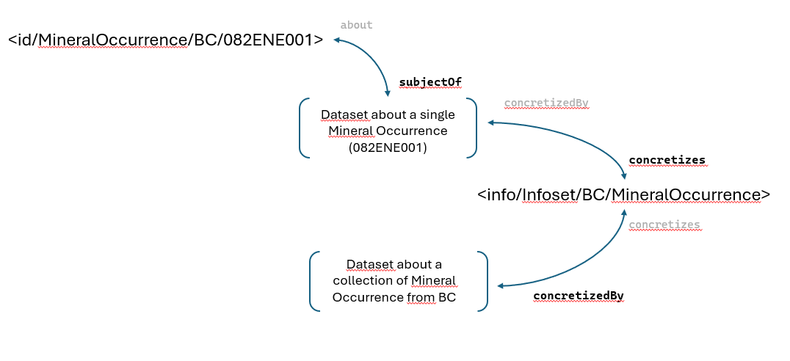
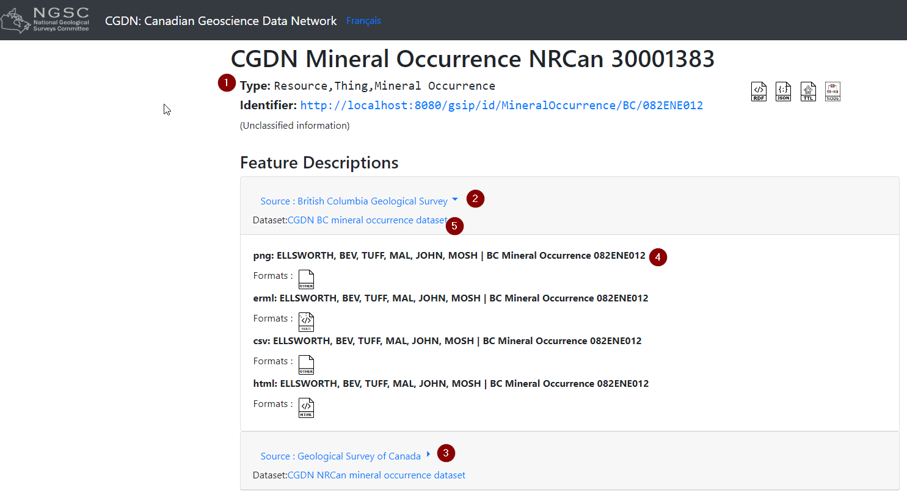
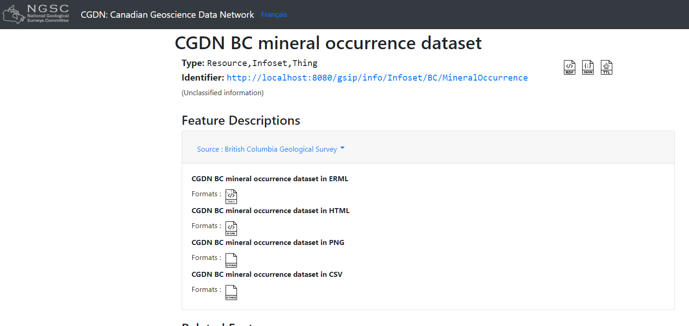

= Infoset ontology (Sept 2024)
:sectnums:
:toc:
:toclevels: 3
:imagesdir: img
:icons: font
ifdef::env-github[]
:tip-caption: :bulb:
:note-caption: :information_source:
:important-caption: :heavy_exclamation_mark:
:caution-caption: :fire:
:warning-caption: :warning:
endif::[]

:toc!:

== Introduction

In September 2024, the ontology was updated to include the concept of 'infoset'.   It adds to the previous model, therefore the linkage between real things and the datasets remains the same. This additions was necessary to provide collection of things, or more accurately, a collection of data about things.  

Info (`/info/`) can now explicitly be present in the registry.  In the previous ontology, NIR (`/id/`) had an implicit (`/info/`) that represented the landing page itself (or other machine readable representation of that page).  Each `/id/` add an implicit `/info/`.  The new ontology authorised the existance of explicit `/info/` that are not implicit representation of an associated `/id/` but represents a distinct Infoset.  

Those Infoset are Collections of dataset and are not matched by a real world thing (although they might).

The change in the ontology also resulted in a change in the application (GSIP) behavior.  The application must now resolve `/info/` without the existance of a implicit `/id/`.  This change implies there are now two type of resolutions.

   * a resolution that turn a real thing (`/id/`) into its implicits `/info/` 
   * a new resolution that invokes directly a `/info/`

This impacts how the registry is queried.

== Ontology

The new ontology describes :

   * Things (real things in the world)  also called a NIR ( Non-Information Resource, because the resource represents a real thing, therefore is a non-information) are identified by URI with a `/id/`.
   * Dataset, which are chunk of binary data, either text or images,  are presented in various formats (HTML, CSV, ERML) also called IR (Information URI) because the resource are machine readable bits of information.
   * Infoset are collections of datasets. 
   * A thing can be the subject of a dataset.
   * An Infoset can be concretized by a dataset 

In this simplified example, we kept the essential statements to describe the relationship between the important elements

[source,ttl]
----
<id/MineralOccurrence/BC/082ENE001>
    a cgdn:MineralOccurrence ;
    schema:subjectOf [
        cgdn:concretizes <info/Infoset/BC/MineralOccurrence> ;
        dct:format "text/html" ;
        schema:provider <https://www2.gov.bc.ca/gov/content?id=279686BC782F47ECA7B257376391D210> ;
        schema:url "http://minfile.gov.bc.ca/Summary.aspx?minfilno=082ENE001"
    ].

<info/Infoset/BC/MineralOccurrence>
    a cgdn:Infoset;
    cgdn:concretizedBy [
        cgdn:concretizes <info/Infoset/BC/MineralOccurrence> ;
        dct:format "application/gml+xml;subtype=erml" ;
        schema:provider <https://www2.gov.bc.ca/gov/content?id=279686BC782F47ECA7B257376391D210> ;
        schema:url "http://apps.empr.gov.bc.ca/geoserver/cgi/ows?service=WFS&version=1.1.0&request=GetFeature&typeName=cgi%3ACA-BC-BCGS-mineral-occurrences&outputFormat=gml32&SORTBY=identifier" 
    ].
---- 

   * `<id/MineralOccurrence/BC/082ENE001>` a mineral occurrence
   * `<info/Infoset/BC/MineralOccurrence>` an `Infoset` (a collection)
   * dataset are represented as `blank nodes` delimited by [ and ] which are anonymous resources
   * dataset have providers (sources)

This example says that the mineral occurrence `<id/MineralOccurrence/BC/082ENE001>` is the subject of a dataset in html located at  "http://minfile.gov.bc.ca/Summary.aspx?minfilno=082ENE001".  This dataset (the data represented in the HTML page) is part (partially concretizes) of a larger infoset `<info/Infoset/BC/MineralOccurrence>` that (completely) concretized by a dataset in ERML (one of the possible format) located at "http://apps.empr.gov.bc.ca/geoserver/cgi/ows?service=WFS&version=1.1.0&request=GetFeature&typeName=cgi%3ACA-BC-BCGS-mineral-occurrences&outputFormat=gml32&SORTBY=identifier".

Both datasets are from the same provider.

== Landing pages

Landing pages are built by querying the registry and pulling the subset of data required to populate the page (or the other representations of that page, such as JSON-LD or TTL).

=== NIR

Landing pages 

   * 1: information about the NIR
   * 2: A section providing all the dataset from a single provider: BC
   * 3: A section (collapsed in this page) providing all dataset from GSC:
   * 4: one of the dataset (in PNG)
   * 5: a link to the Infoset

=== Infoset

